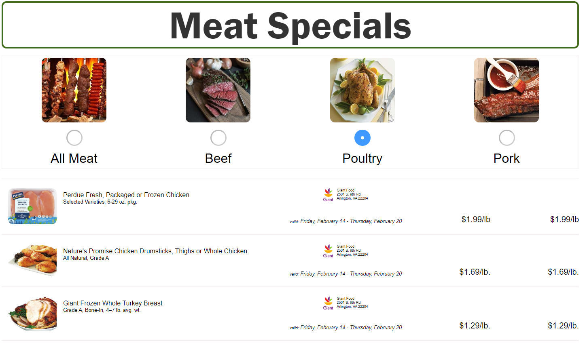
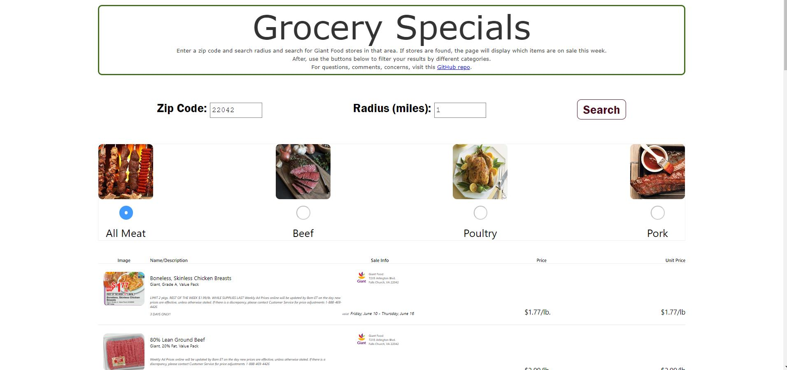
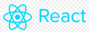
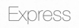
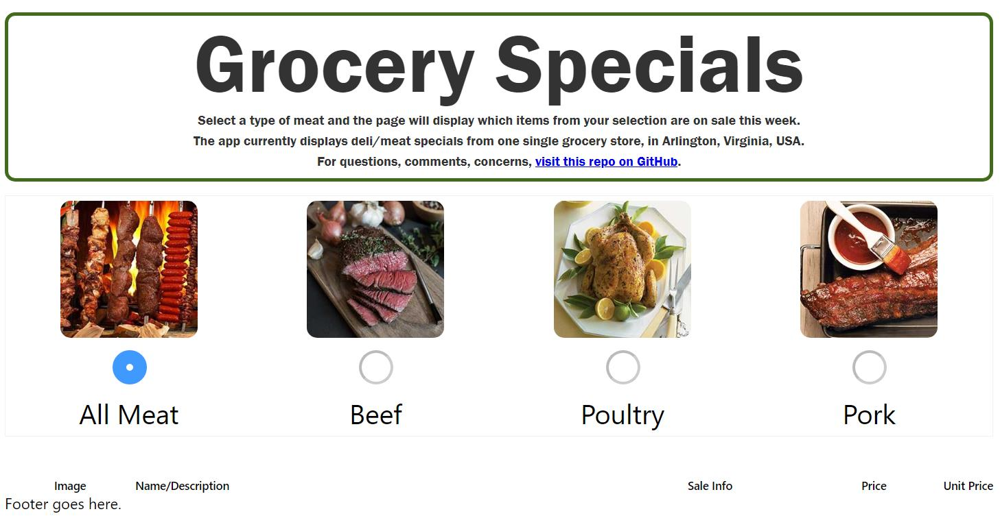
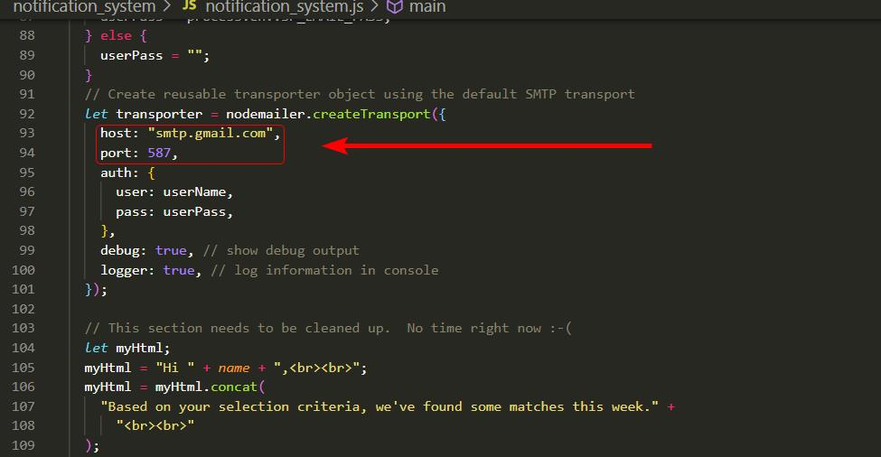
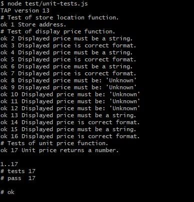

<!--  -->

<h1 align="center"><a name = "header">Grocery Specials Web App</a></h1>

  <!--  -->

  <!--  -->

This web app automatically reads the current specials in the meat/deli department for one specific grocery store (with more to come). From that, it does two things:

- Displays the specials on a web page, in a filterable list.

- Allows users to select their favorite items, as well as a threshold price on each item. The app will then email the user once any of those items go on sale for less than their threshold price.

This is a passion project of mine, built with ReactJS. It is by no means complete, or even that useful in its current version. See the [To-Do List](#to_do_list) below for future plans.

## 📝 Table of Contents

- [About](#about)
- [Technology Stack](#technology_stack)
- [Installation](#installation)
- [Usage](#usage)
- [Deploy](#deploy)
- [Unit Testing](#unit_testing)
- [To-Do List](#to_do_list)
- [Authors](#authors)

## 🧐 About 

Eating frugally is a goal for many people. For those that cook at home a good strategy is to wait for your favorite food items to go on sale at a local grocery store, then stock up on those items. But how do you know when your favorite items are on sale? The only way is to visit the store's website and look through the [weekly circular](https://circular.giantfood.com/flyers/giantfood?type=2&show_shopping_list_integration=1&postal_code=22204&use_requested_domain=true&store_code=0774&is_store_selection=true&auto_flyer=&sort_by=#!/flyers/giantfood-weekly?flyer_run_id=406535) for your favorite item--which may or may not be present--then repeat the process for <i>all other</i> area stores. This is quite tedious.

The two components of this app help alleviate these issues:

- Browse Component: Displays the weekly specials for multiple stores in a single list, which is easy to browse, search, etc.
- Notify Component (optional): Automatically emails you when your favorite items go on sale for below a threshold price. For example, you can receive an email whenever ribeye steaks go on sale for less than $5.00/lb.

_Note: Currently, both the Browse Component and the Notify Component use the weekly specials from only one specific store. See the footnote in the [Usage section](#usage) for more information._

## :information_source: Technology Stack 

|                                                                                                             |                                     |                                                                                                                    |
| ----------------------------------------------------------------------------------------------------------- | ----------------------------------- | ------------------------------------------------------------------------------------------------------------------ |
|  | [ReactJS](https://reactjs.org/)     | Web Framework. I used the [Create React App project](https://github.com/facebook/create-react-app) to get started. |
|   | [Node.js](https://nodejs.org/)      | Server Environment                                                                                                 |
|  | [Express](https://expressjs.com/)   | Web Server Environment                                                                                             |
|  | [MongoDB](https://www.mongodb.com/) | Database                                                                                                           |

## ⛏️ Installation 

This section should help get you a copy of the project up and running on your local machine for development and testing purposes. The instructions are separated into those which setup the app's Browse component, and those which setup the app's Notify component.

### Prerequisites

- Node.js installed on your system. I'm not sure on the absolute minimum version required, but I can say that to date, the majority of development has been with Node versions 12 and 13.
- Access to a valid GMail account (or other email account).
- Ability to create a MongoDB Atlas database (any plan--including the free plan--should be sufficient).

### Install the Project

1. Clone: Clone the GitHub project to your local machine. Here are more resources on how to do that:

- [Git Basics - Getting a Git Repository](https://git-scm.com/book/en/v2/Git-Basics-Getting-a-Git-Repository)
- [`git-clone` documentation](https://git-scm.com/docs/git-clone)

2. Install Dependencies: After the project has been cloned to your local machine, install the project's Node dependencies. To do so, from your command line navigate to the project's root directory and execute:

`npm install`

This should complete without any errors (warnings are OK).

### Configure the Browse Component

1. Test: Test the Browse Component by opening it in your browser. To do that, from your command line navigate to the project's root directory and execute:

`npm start`

After, your default browser should automatically open and display the app's Browse Component. You should see something similar to the screenshot depicted in at the very top of this README ([link here](#header)). If your screen displays radio buttons, but no items underneath, proceed to step #2.

2. Implement CORS Fix (if necessary): In many cases, after you complete the previous step, the browser will open but display no data, i.e. no items. The screen will look like the screenshot below:

In addition, you should see an error in the browser's JavaScript console, similar to this:

`Access to fetch at 'https://circular.giantfood.com/flyers/giantfood?type=2&show_shopping_list_integration=1&postal_code=22204&use_requested_domain=true&store_code=0233&is_store_selection=true&auto_flyer=&sort_by=#!/flyers/giantfood-weekly?flyer_run_id=406535' from origin 'http://localhost:3000' has been blocked by CORS policy: No 'Access-Control-Allow-Origin' header is present on the requested resource. If an opaque response serves your needs, set the request's mode to 'no-cors' to fetch the resource with CORS disabled.`

To resolve this, you need to implement a solution which can temporarily enable Cross Origin Resource Sharing (CORS) in your browser. One suggestion is to install and enable the [Allow CORS: Access-Control-Allow-Origin](https://chrome.google.com/webstore/detail/allow-cors-access-control/lhobafahddgcelffkeicbaginigeejlf) Chrome browser extension.

### Configure the Notify Component (optional)

Configuring this component is a little trickier, and admittedly fragile for now. I want to improve it. But for now, drop me a message if you get stuck.

1. Create a MongoDB database using [MongoDB Atlas](https://www.mongodb.com/cloud/atlas). A free plan should suffice. Name the database:

`sp_back`

2. To your database, add a collection named:

`somemodels`

3. Populate your database with at least one document. This document will describe one user that will receive an email from the notification system. The document should contain specific field names and types. See the table below for more info:

| field name | type   | description                                                                 |
| ---------- | ------ | --------------------------------------------------------------------------- |
| name       | string | First name of the user.                                                     |
| email      | string | Email address of the user.                                                  |
| meat       | string | Only the following values are valid: `beef` \| `poultry` \| `pork` \| `all` |
| th_price   | number | Threshold price, e.g. `5.00`                                                |

4. On your local system, create two environmental variables:

| variable name | variable value                            |
| ------------- | ----------------------------------------- |
| SP_DB_USER    | Username for your newly created database. |
| SP_DB_PASS    | Password for your newly created database. |

5. Obtain access to a Gmail account that will allow access from a third party app. To configure a Gmail account to allow access from a third party app, see [these instructions](https://support.google.com/mail/answer/185833?hl=en-GB).

It is possible to use a non-Gmail account, but if you do so, you will have to manually make edits to the project file `notification_system/notification_system.js`. Specifically, you'll have to edit the object passed to `createTransport()` and ensure it reflect the details of your email provider.

6.  On your local system, create two environmental variables:

| variable name | variable value                                           |
| ------------- | -------------------------------------------------------- |
| SP_EMAIL_USER | Username for your email account.                         |
| SP_EMAIL_PASS | Password for your email account (or Gmail app password). |

## 💻 Usage 

### Use the Browse Component

From your command line navigate to the project's root directory and execute:

`npm start`

After, your default browser should automatically open and display the app's Browse Component. You should see something similar to the screenshot depicted in at the very top of this README ([link here](#header)).

On the screen, all of the items from the deli/meat department should be listed, along with their details, price, and if possible, their unit price.

To filter by different meat types (beef, chicken, or pork), use the radio buttons at the top of the page.

_Note: For now, the Browser Component is best viewed on desktop devices. The layout is quite broken at tablet/mobile screen widths._

### Use the Notify Component

From your command line navigate to the project's root directory and execute:

`node notification_system/notification_system.js`

After, one email should be sent to all users in your database, listing which items from this week's specials meet the user's criteria (i.e. meat type and threshold price).

For example, in your database you have a document with the following data:

| field name | value                  |
| ---------- | ---------------------- |
| name       | "John Doe"             |
| email      | "john.doe@example.com" |
| meat       | "poultry"              |
| th_price   | 7.0                    |

When you execute the above command from the command line, an email will be sent to john.doe@example.com. The email will contain a list of all items from this week's specials that meet the criteria:

- meat type is poultry.
- unit price less than $7.00 per pound.

---

_Note: In its current state, the app fetches weekly specials from one specific grocery store: a Giant Food grocery store in Falls Church, VA, USA._

## 🚀 Deploy 

I have deployed my app to a live server--hosted by Heroku. The Browse Component of that app can be seen [here](https://gentle-gorge-04163.herokuapp.com/). The Notify Component is configured to run once a week.

## :memo: Unit Testing 

Unit tests are a work in progress :smiley: There are a few unit tests written, using [Tape](https://github.com/substack/tape). The unit tests are in the file `test/unit-tests.js`. To execute the unit tests in that file, from your command line navigate to the project's root directory and execute:

`node test/unit-tests.js`

After, output should be printed to the console, similar to this screenshot:

## 📋 To-Do List (last updated 18 Feb 2021) 

Here is a list of features/fixes I would like to implement soon:

- Increase the number of stores searched by the app.
- Browse Component: Make fully responsive.
- Fix price displays bugs in emails sent in Notify Component.

## ✍️ Authors 

- Carl Gross ([@cagross](https://github.com/cagross))
