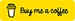
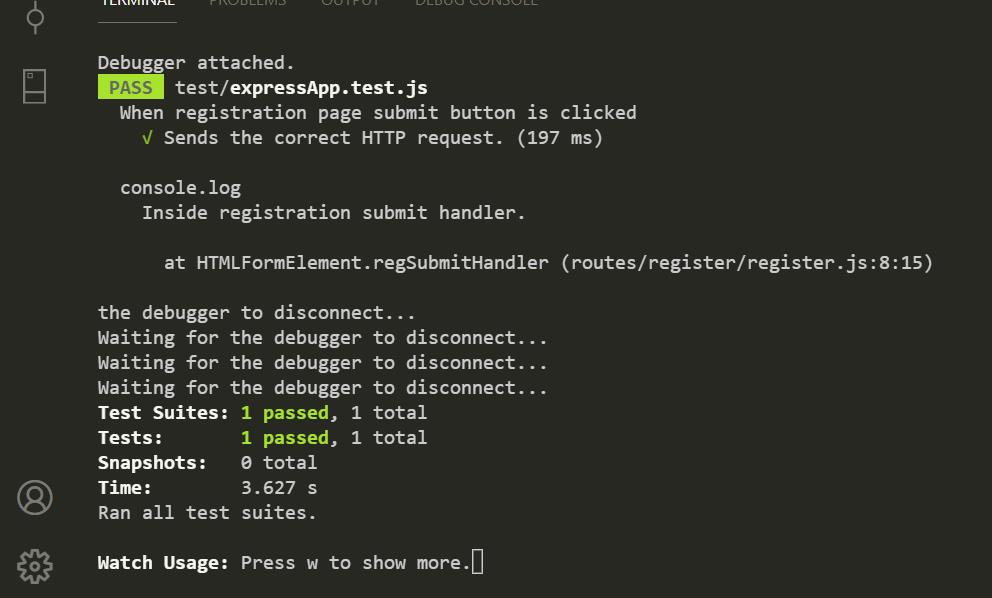

<!--  -->

<h1 align="center"><a name = "header">Grocery Specials Web App</a></h1>

  <!--  -->

<!--  -->
<!--  -->

<!-- 

 -->

<!--  -->

<!--  -->

This web app automatically reads the current specials in the meat/deli department for one specific grocery store (with more to come). From that, it does two things:

- Displays the specials on a web page, in a filterable list.

- Allows users to select their favorite items, as well as a threshold price on each item. The app will then email the user once any of those items go on sale for less than their threshold price.

This is a passion project of mine, built with ReactJS. It is by no means complete. See the [To-Do List](#to_do_list) below for future plans.

## 📝 Table of Contents

- [About](#about)
- [Technology Stack](#technology_stack)
- [Installation](#installation)
- [Usage](#usage)
- [Deploy](#deploy)
- [Unit Testing](#unit_testing)
- [To-Do List](#to_do_list)
- [Authors](#authors)

## 🧐 About 

Eating frugally is a goal for many people. For those that cook at home a good strategy is to wait for your favorite food items to go on sale at a local grocery store, then stock up on those items. But how do you know when your favorite items are on sale? The only way is to visit the store's website and look through the [weekly circular](https://circular.giantfood.com/flyers/giantfood?type=2&show_shopping_list_integration=1&postal_code=22204&use_requested_domain=true&store_code=0774&is_store_selection=true&auto_flyer=&sort_by=#!/flyers/giantfood-weekly?flyer_run_id=406535) for your favorite item--which may or may not be present--then repeat the process for <i>all other</i> area stores. This is quite tedious.

The two components of this app help alleviate these issues:

- Browse component: Displays the weekly specials for multiple stores in a single list, which is easy to browse, search, etc.
- Notify component (optional): Automatically emails you when your favorite items go on sale for below a threshold price. For example, you can receive an email whenever ribeye steaks go on sale for less than $5.00/lb.

_Note: Currently, both the browse component and the notify component use the weekly specials from only one specific store. See the footnote in the [Usage section](#usage) for more information._

## :information_source: Technology Stack 

|                                                                                                             |                                     |                                                                                                                    |
| ----------------------------------------------------------------------------------------------------------- | ----------------------------------- | ------------------------------------------------------------------------------------------------------------------ |
|  | [ReactJS](https://reactjs.org/)     | Web Framework. I used the [Create React App project](https://github.com/facebook/create-react-app) to get started. |
|   | [Node.js](https://nodejs.org/)      | Server Environment                                                                                                 |
|  | [Express](https://expressjs.com/)   | Web Server Environment                                                                                             |
|  | [MongoDB](https://www.mongodb.com/) | Database                                                                                                           |

## ⛏️ Installation 

This section should help you get a copy of the project up and running on your local machine for development and testing purposes. The instructions are separated into those which setup the app's browse component, and those which setup the app's notify component.

### Prerequisites

- Node.js installed on your system. I'm not sure on the absolute minimum version required, but I can say that to date, the majority of development has been with Node versions 12 and 13.
- Access to a valid GMail account (or other email account).
- Ability to create a MongoDB Atlas database (any plan--including the free plan--should be sufficient).

### Install the Project

1. Clone: Clone the GitHub project to your local machine. Here are more resources on how to do that:

- [Git Basics - Getting a Git Repository](https://git-scm.com/book/en/v2/Git-Basics-Getting-a-Git-Repository)
- [`git-clone` documentation](https://git-scm.com/docs/git-clone)

2. Install Dependencies: After the project has been cloned to your local machine, install the project's Node dependencies. To do so, from your command line navigate to the project's root directory and execute:

`npm install`

This should complete without any errors (warnings are OK). Then, from your command line navigate to the project's `client` directory and execute:

`npm install`

This should complete without any errors (warnings are OK).

### Configure the browse component

1. Add environmental variables: On your local system, create one environmental variable:

| variable name     | variable value                                             |
| ----------------- | ---------------------------------------------------------- |
| SP_SESSION_SECRET | String of text of your choosing. Length: 20-50 characters. |

### Configure the notify component (optional)

Configuring this component is a little trickier, and admittedly fragile for now. I want to improve it. But for now, drop me a message if you get stuck.

1. Create a MongoDB database using [MongoDB Atlas](https://www.mongodb.com/cloud/atlas). A free plan should suffice. Name the database:

`sp_back`

2. To your database, add a collection named:

`users`

3. On your local system, create two environmental variables:

| variable name | variable value                            |
| ------------- | ----------------------------------------- |
| SP_DB_USER    | Username for your newly created database. |
| SP_DB_PASS    | Password for your newly created database. |

4. Obtain access to a Gmail account that will allow access from a third party app. To configure a Gmail account to allow access from a third party app, see [these instructions](https://support.google.com/mail/answer/185833?hl=en-GB).

If you cannot setup a Gmail account, it _is_ possible to use a non-Gmail account. But if you do so, you will have to manually make edits to the project file `client/notification_system/notification_system.js`. Specifically, you'll have to edit the object passed to `createTransport()` and ensure it reflect the details of your email provider.

5.  On your local system, create two environmental variables:

| variable name | variable value                                           |
| ------------- | -------------------------------------------------------- |
| SP_EMAIL_USER | Username for your email account.                         |
| SP_EMAIL_PASS | Password for your email account (or Gmail app password). |

## 💻 Usage 

### Use the browse component

1. Start the web server listening on port 5555. To do that, from your command line navigate to the project's root directory and execute:

`npm start`

That should complete without issue, with output reading: `Server running on port 5555`.

2. Open your browser to `http://localhost:5555` and it should display the app's browse component. You should see something similar to the screenshot depicted in at the very top of this README ([link here](#header)).

On the screen, all of the items from the deli/meat department should be listed, along with their details, price, and if possible, their unit price.

To filter by different meat types (beef, chicken, or pork), use the radio buttons at the top of the page.

_Note: For now, the browse component is best viewed on desktop devices. The layout is quite broken at tablet/mobile screen widths._

### Use the notify component

1. Create a user: To create a user, first start the web server listening on port 5555 (if it is not already doing so). To do that,from your command line navigate to the project's root directory and execute:

`npm start`

That should complete without issue, with output reading: `Server running on port 5555.`

2. In your browser, navigate to: `http://localhost:5555/register`. Complete and submit the registration form on the page.

3. From your command line navigate to the project's root directory and execute:

`node client/notification_system/notification_system.js`

That should complete without error. After, one email should be sent to your user's email address, listing which items from this week's specials meet the user's criteria (i.e. meat type and threshold price).

For example, let's say you created a user with with the following data:

| field           | value                |
| --------------- | -------------------- |
| Username        | john.doe@example.com |
| Meat Preference | poultry              |
| Threshold Price | 7.0                  |

When you execute the above command from the command line, an email will be sent to john.doe@example.com. The email will contain a list of all items from this week's specials that meet all of the following criteria:

- meat type is poultry.
- unit price less than or equal to $7.00 per pound.

_Note: The email will be sent only if this week's specials contain an item that meets your criteria (e.g. poultry sold for less than $7.00/lb)._

---

_Note: In its current state, the app fetches weekly specials from one specific grocery store: a Giant Food grocery store in Falls Church, VA, USA._

## 🚀 Deploy 

I have deployed my app to a live server--hosted by Heroku. The browse component of that app can be seen [here](https://gentle-gorge-04163.herokuapp.com/). The notify component is configured to run once a week.

## :memo: Unit Testing 

Unit tests are a work in progress :smiley: There are unfortunately some unit tests written with [Tape](https://github.com/substack/tape), and others with [Jest](https://jestjs.io/). See below for details.

### Tape Unit Tests

The Tape unit tests are in the file `client/src/test/unit-tests.js`. To execute the unit tests in that file, from your command line navigate to the project's root directory and execute:

`node test/unit-tests.js`

After, output should be printed to the console, similar to this screenshot:

Additionally, if you are using VSCode, and have the Run on Save extension enabled, these unit tests will be automatically run whenever a .js file is saved.

### Jest Unit Tests

The Jest unit tests are in the file `client/src/test/jesty.test.js`. To execute the unit tests in that file, open the VSCode terminal and navigate to the project's `client` directory. Then execute:

`npm test -- --watch`

After, the unit tests should be executed and output printed to the VSCode terminal, similar to this screenshot:

Furthermore, as long as you keep the VSCode terminal open, these tests will be automatically run whenever a .js file is saved.

## 📋 To-Do List (last updated 18 Feb 2021) 

Here is a list of features/fixes I would like to implement soon:

- Increase the number of stores searched by the app.
- Browse component: Make fully responsive.
- Fix price displays bugs in emails sent in notify component. See [here](https://github.com/cagross/react-specials/issues/12).

## ✍️ Authors 

- Carl Gross ([@cagross](https://github.com/cagross))
