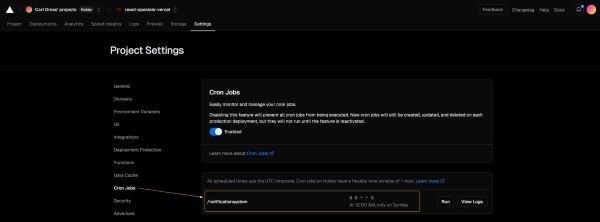

<h1 align="center"><a name = "header">Grocery Specials Web App</a></h1>

  <!--  -->

<h2>Note: As of November 2022 I am no longer maintaining this repo, aside from dependency updates. As such, as time goes on, some of these instructions may become incorrect/outdated.</h2>

This browser-based app allows users to search for grocery stores in a particular area, then fetches the current specials from those stores. After, it does two things:

- Displays the specials on a web page, in a filterable list.

- Calculates and displays the unit cost of each item.

- Allows users to select their favorite items, as well as a threshold price on each item. The app will then email the user once any of those items go on sale for less than their threshold price.

This is a passion project of mine, built with ReactJS. It is by no means complete. See the [To-Do List](#to_do_list) below for future plans.

For a working demo of this app, please visit: https://react-specials-vercel.vercel.app/

## 📝 Table of Contents

- [About](#about)
- [Technology Stack](#technology_stack)
- [Installation](#installation)
- [Usage](#usage)
- [Deploy](#deploy)
- [Edits](#edits)
- [Tests](#tests)
- [Managing Dependencies](#managing-dependencies)
- [To-Do List](#to_do_list)
- [Authors](#authors)

## 🧐 About 

Eating frugally is a goal for many people. For those that cook at home a good strategy is to wait for your favorite food items to go on sale at a local grocery store, then stock up on those items. But how do you know when your favorite items are on sale? The only way is to visit the store's website and look through the [weekly circular](https://circular.giantfood.com/flyers/giantfood?type=2&show_shopping_list_integration=1&postal_code=22204&use_requested_domain=true&store_code=0774&is_store_selection=true&auto_flyer=&sort_by=#!/flyers/giantfood-weekly?flyer_run_id=406535) for your favorite item--which may or may not be present--then repeat the process for <i>all other</i> area stores. This is quite tedious.

The two components of this app help alleviate these issues:

- Browse component: Displays the weekly specials for multiple stores in a single list, which is easy to browse, search, etc.
- Notify component (optional): Automatically emails you when your favorite items go on sale for below a threshold price. For example, you can receive an email whenever ribeye steaks go on sale for less than $5.00/lb.

_Note: Currently the notify component uses the weekly specials from only one single grocery store chain. See the footnote in the [Usage section](#usage) for more information._

## :information_source: Technology Stack 

|                                                                                    |                                     |                        |
| ---------------------------------------------------------------------------------- | ----------------------------------- | ---------------------- |
|    | [React](https://react.dev/)         | UI Library             |
|   | [Node.js](https://nodejs.org/)      | Server Environment     |
|  | [Express](https://expressjs.com/)   | Web Server Environment |
|  | [MongoDB](https://www.mongodb.com/) | Database               |

## ⛏️ Installation and Configuration 

This section should help you get a copy of the project up and running on your local machine for development and testing purposes. The instructions are separated into those which setup the app's browse component, and those which setup the app's notify component. Neither component is required, i.e. you can configure the browse component for use without configuring the notify component (and vice versa).

### Prerequisites

- Node.js installed on your system. I'm not sure on the absolute minimum version required, but I can say that to date, the majority of development has been with Node versions 12 and 13.
- Access to a valid GMail account (or other email account allowing you to send emails). Required for the notify component only.
- Ability to create a MongoDB Atlas database (any plan--including the free plan--should be sufficient).

### Install the Project

1. Clone: Clone this GitHub project to your local machine. Here are more resources on how to do that:

- [Git Basics - Getting a Git Repository](https://git-scm.com/book/en/v2/Git-Basics-Getting-a-Git-Repository)
- [`git-clone` documentation](https://git-scm.com/docs/git-clone)

2. Install Dependencies: After the project has been cloned to your local machine, install the project's Node dependencies. To do so, from your command line navigate to the project's root directory and execute:

`npm install`

This should complete without any errors (warnings are OK). Then, from your command line navigate to the project's `client` directory and execute:

`npm install`

This should complete without any errors (warnings are OK).

### Configure the browse component

1. Add environmental variables: On your local system, create the following environmental variable:

| variable name     | variable value                                             |
| ----------------- | ---------------------------------------------------------- |
| SP_SESSION_SECRET | String of text of your choosing. Length: 20-50 characters. |

### Configure the notify component

Configuring this component is a little trickier, and admittedly fragile for now. I want to improve it. But for now, drop me a message if you get stuck.

1. Using a MongoDB plan (a free plan should suffice), create two different MongoDB databases using [MongoDB Atlas](https://www.mongodb.com/cloud/atlas). The database names should be:

- `sp_back`
- `connect_mongodb_session_test`

2. To your `sp_back` database, add a collection named:

`users`

3. Ensure the `users` collection has the following fields and types.

| field name | type       |
| ---------- | ---------- |
| name       | String     |
| email      | String     |
| meat       | String     |
| th_price   | Decimal128 |
| password   | String     |

4. To your `connect_mongodb_session_test` database, add a collection named:

`mySessions`

5. Ensure the `mySessions` collection has the following fields and types.

| field name | type   |
| ---------- | ------ |
| expires    | Date   |
| sessions   | Object |

6. Obtain access to a Gmail account that will allow access from a third party app. To configure a Gmail account to allow access from a third party app, see [these instructions](https://support.google.com/mail/answer/185833?hl=en-GB).

If you cannot setup a Gmail account, it _is_ possible to use a non-Gmail account. But if you do so, you will have to manually make edits to the project file `client/notification_system/notification_system.js`. Specifically, you'll have to edit the object passed to `createTransport()` and ensure it reflect the details of your email provider.

7.  On your local system, create four environmental variables:

| variable name | variable value                                             |
| ------------- | ---------------------------------------------------------- |
| SP_DB_USER    | _Username for your newly created database._                |
| SP_DB_PASS    | _Password for your newly created database._                |
| SP_EMAIL_USER | _Username for your email account._                         |
| SP_EMAIL_PASS | _Password for your email account (or Gmail app password)._ |

## 💻 Usage 

### Use the browse component

1. Start the web server listening on port 5555. To do that, from your command line navigate to the project's root directory and execute:

`npm start`

That should complete without issue, with output reading: `Server running on port 5555`.

2. Open your browser to `http://localhost:5555` and it should display the app's browse component. You should see something similar to the screenshot depicted in at the very top of this README ([link here](#header)).

On the screen should be a small search form, requiring you to enter a US zip code and a radius (in miles). Once a search is executed, and results are found, all of the items from the deli/meat department should be listed--for all stores in the search area. In addition, each item will also display its details, price, and if possible, unit price.

_Note: For now, due to performance concerns, the store search feature limits results to three stores._

To filter results by different meat types (beef, chicken, or pork), use the large radio buttons on the page.

_Note: For now, the browse component is best viewed on desktop devices. The layout is quite broken at tablet/mobile screen widths._

### Use the notify component

#### First, create a user. To do so, carry out the following steps:

a) Start the web server listening on port 5555 (if it is not already doing so). To do that,from your command line navigate to the project's root directory and execute:

`npm start`

That should complete without issue, with output reading: `Server running on port 5555.`

b) In your browser, navigate to: `http://localhost:5555/register`. Complete and submit the registration form on the page. That should complete without error. If so, you will have created a user for yourself.

#### Next, execute a manual test of the notify component. To do so, carry out the following steps:

a) From your command line navigate to the project's root directory and execute:

`node dev/runNotify.js`

That should complete without error. If so, an email should be sent to your user's email address, listing which items from this week's specials meet the user's criteria (i.e. meat type and threshold price).

For example, let's say you created a user with with the following data:

| field           | value                |
| --------------- | -------------------- |
| Username        | john.doe@example.com |
| Meat Preference | poultry              |
| Threshold Price | 7.0                  |

When you execute the above command from the command line, an email will be sent to john.doe@example.com. The email will contain a list of all items from this week's specials that satisfy all of the following criteria:

- meat type is poultry.
- unit price less than or equal to $7.00 per pound.

If you receive this email, the manual test of the notify component has passed :-)

#### Finally, (if desired) configure the notify system to run automatically. To do so, carry out the following steps:

Since new circulars are released once a week, the logical schedule for the notify component is to run it once a week. But you are free to run it with any frequentcy you desire. The following section can help you setup the notify component to automatically run on a set schedule.

The simplest/easiest way to ensure the notify component runs automatically is to find a hosting platform which has a feature to automatically run the notify component on a set schedule. For example, if you deploy your app to Heroku, they have a [Heroku Scheduler](https://devcenter.heroku.com/articles/scheduler) feature which can execute custom code on a set schedule. Alternatively you can use a third party NPM package like node-cron to do the same.

I have very recently migrated my hosting to Vercel, which has a Cron Jobs feature. I used this feature to ensure the notify component is executed on a weekly schedule. The instructions are below. To be clear, this applies only to the app deployed to Vercel--it does not apply to my local app.

- First deploy your app to Vercel (see [Deploy](#deploy) section).

- Open your project in the Vercel dashboard, then open the Cron Jobs section. Fill out all fields exactly as they are filled out in the screenshot below, then save.

## 

After, your notification system should automatically run once a week at midnight UTC.

_Note: In its current state, the notify system fetches weekly specials from one specific grocery store: a Giant Food grocery store in Falls Church, VA, USA._

## :memo: Making Edits 

- Front-end edits: When editing the front-end React app--i.e. any file in the `client/src` folder--note that before you can see those changes in your browser, you'll need to rebuild the React app. To do that, from your command line navigate to the project's `client` directory and execute:

`npm run build`

- Back-end edits: When editing the back-end files, e.g. most other files--including those in the `controllers`, `models`, `routes`, or `src` folders--note that before your web server can see those changes, you'll need to restart the Express app. To do that, from your command line navigate to the project's root directory and execute `npm start`. If you carried out that step _before_ making your edits, then you should not have to re-execute `npm start`--the server should automatically restart after you saved your edits.

## 🚀 Deploy and Demo 

I have deployed a working demo of this app to a live server. The app can be viewed in a browser [here](https://react-specials-vercel.vercel.app/). From there you can use the browse component of the app, as well as register for an account. After registration, users should receive a weekly email from the notify component.

## :heavy_check_mark: Automated Tests 

The automated tests are currently a mix of unit tests and end-to-end tests. See below for more information on each.

### Unit Tests

Unit tests are written using the [Tape test runner](https://github.com/substack/tape). They are located in the files `client/src/test/unit-tests.js` and `client/src/test/unit-tests-data.js`. To execute the unit tests in each file, from your command line navigate to the project's root directory and execute:

`node test/unit-tests.js` or `node test/unit-tests-data.js`

After, output should be printed to the console, similar to this screenshot:

Additionally, if you are using VSCode, and have the Run on Save extension enabled, all unit tests should be automatically run whenever a `.js` file is saved.

### End-To-End Tests

End-To-End tests are written using the [Cypress test suite](https://www.cypress.io/). Those tests are located in several different files. Each file name ends in `.spec.js`, and they are all located in the `client/cypress/integration` folder. To execute one (or all) of those tests, do the following:

1. Start the web server listening on port 5555. To do that, from your command line navigate to the project's root directory and execute:

`npm start`

That should complete without issue, with output reading: `Server running on port 5555`.

2. From your command line navigate to the project's `client` directory. Then execute:

`npx cypress open --config pluginsFile=false`

After, the Cypress GUI should open, which will list all three test files. You have the option to run each individually, or run them all (see screenshot below).

3. To execute all tests, click the 'Run 3 integration specs' link in the top right. A browser window should open and automatically execute all Cypress tests. They should all complete, and show passing results, as in the screenshot below).

4. Unless you stop the Cypress tests (in the Cypress GUI), these tests will be automatically run whenever a .js file is saved.

_Note: If you have made any recent edits to files in the `client/src` folder, be sure to re-build the React app before running the Cypress tests. If not, you may experience unexpected results. See the [Edits section](#edits) for information on how to re-build the React app._

## 📦 Managing Dependencies

For detailed information on the current state of dependencies, please refer to the [Notable Dependency Issues](dependency-updates.md).

## 📋 To-Do List (last updated 18 Feb 2021) 

Here is a short list of features/fixes I would like to implement soon:

- Incorrect prices displayed for items requiring multiple quantities ([fixed](https://github.com/cagross/react-specials/issues/11)).
- [Some unit prices displaying as 'Unknown'.](https://github.com/cagross/react-specials/issues/10)
- [Fix price displays bugs in emails sent in notify component.](https://github.com/cagross/react-specials/issues/12).
- Browse component: Make fully responsive.

## ✍️ Authors 

- Carl Gross ([@cagross](https://github.com/cagross))
